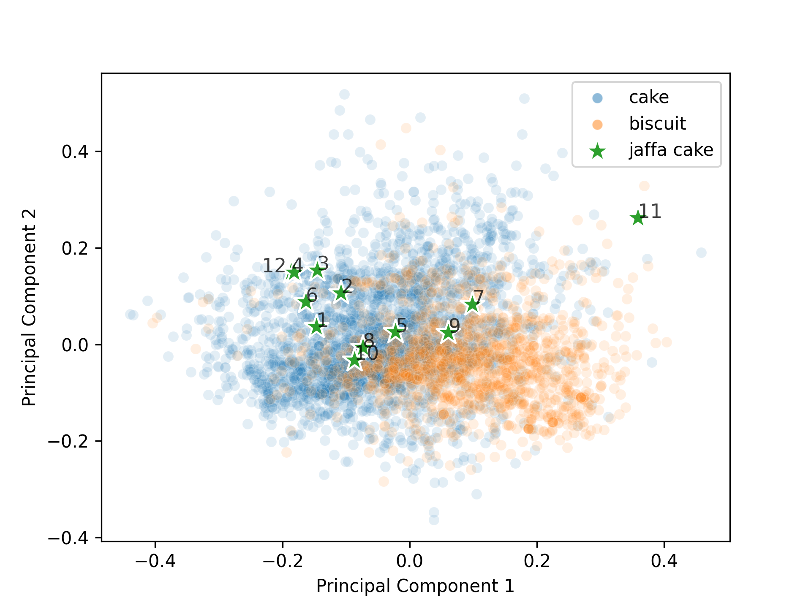
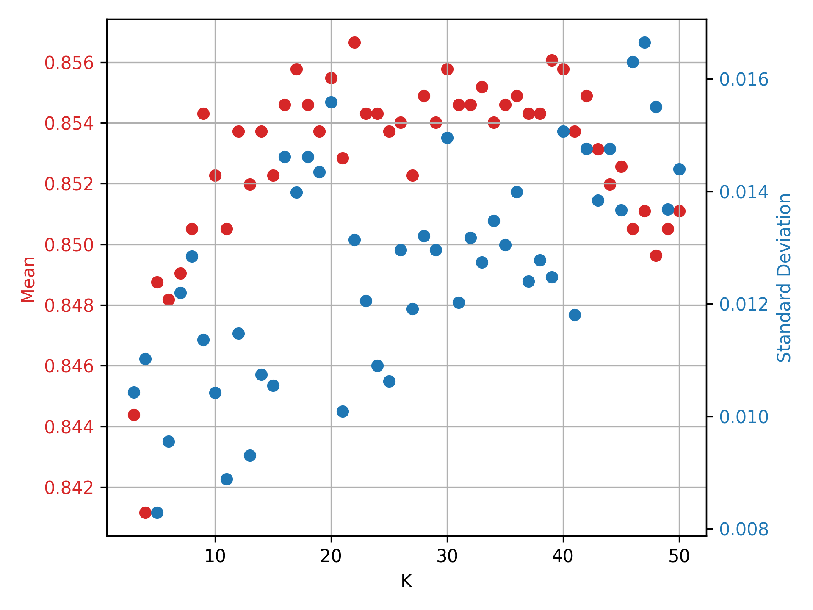

# JaffaCakesClassifier

## Introduction

A Python project to accompany my poster submission for the MATH40008 module. This project scrapes biscuit and cake
recipes from the internet, then does data analysis and classification on the dataset. We end in a prediction of the
class of a set of Jaffa Cake recipes.

## Scraping

The main source for the data is from the cake and biscuit sections of allrecipes.co.uk[[1]](#1). The
scraper first finds the second index page of the section (this is because the first page is formatted differently, and
so cannot be easily scraped). Then, it takes each entry in the page and fetches the recipe link from each one. Within
each recipe link, the scraper finds every `<li>` tag in the ingredients class on the webpage, then extracts the text and
cleans it for later processing. Once this has been done for every recipe link in a page, the script moves on to the next
page by changing the index in the URL. The limit for this url has to be set manually and added to the for loop, and the
number can be found at the bottom of the page of any of the index pages.

The next step is to classify the data into features using regex (ignoring case). This finds the data and converts the
units to be ml or g as appropriate. Broad strokes had to be used to prevent the number of features from becoming too
large, and what goes into each category are defined below in the order they would be accepted - if one is seen before
the other, the latter mention is ignored (e.g. salted butter would be classified as butter, and give 0 to salt):

- Sugar: any string containing the word "sugar"
- Butter: any string containing the words "butter", "margarine", or "oil"
- Egg: any string containing the word "egg" (this includes eggs when separated into yolks and whites, and adjusts
  quantities accordingly) - we have used that an egg contains 52ml of egg, split into 22ml of yolk and 30ml of
  whites[[2]](#2)[[3]](#3)
- Flour: any string containing the words "flour" or "oats"
- Milk: any string containing the word "milk" (this will include vegan milks like soy and milk derivatives
  like condensed milk, though solids (anything measured in grams) will be ignored, e.g. milk chocolate)
- Soda: any string containing the phrases "baking powder" or "soda" (Note that, while self-raising flour contains these,
  self-raising flour does not contribute to these categories)
- Water: any string containing the word "water"
- Salt: any string containing the word "salt"
- Syrup: any string containing the words "syrup" or "honey"

The units where then found using regex in the `quantity_finder()` function, then placed into a dictionary for the
current recipe. This could find units denominated in g, ml, l, kg, oz, lb, tsp, tbsp, dessertspoon, and cup, and will
convert them using standard conversions to convert them into grams or millilitres as appropriate. While these are not
100% comparable, as most liquids used will be of similar density to water, which in itself has a density of roughly
1g/ml[[4]](#4), this should be close enough for our purposes. Should the units not be ascertainable, the unit was
defaulted to grams (this helps in the case of "a pinch of salt"). In this case, recipes where a unit was exclusively
denominated in ounces was removed, as they had a high chance of subverting the regex detection due to inconsistent use
of spaces, and this amounted to a small portion of total results skipped. Note that the recorded recipes omit
ingredients related to flavouring that, in most cases, do not change whether the recipe is for a cake or biscuit, like
nuts, fruits, and jams. An exception to this would be ground nuts, which act like flour, though there do not seem to be
many recipes containing these. To filter out recipes like cheesecakes and other such irrelevant cakes and biscuits
(these are not comparable to the sponge in a Jaffa Cake), recipes using less than 50 grams of either sugar or flour
were removed from the list.

Finally, this data was written into a csv from the dictionary of the recipe each time a new recipe was fully detected,
as this means that, in the rare event of a crash or failure, progress is not lost (at the time of writing, the script
could get through both the cake and biscuit recipe lists without suffering a crash provided the URL does not go outside
the maximum index). These csvs can be found in the `csv_tests` and `data` folders. The final csvs had labels added to
them manually, as well as manual pruning of obviously outlier results (e.g. recipes containing 75kg of flour or 600g
of salt).

## Importing

These datasets are recorded separately into a cake csv and a biscuit csv in the `data` folder. These are imported
into pandas[[5]](#5) DataFrames, duplicates removed from each, leaving 1479 biscuit recipes and 2804 cake recipes, then
concatenated into one larger DataFrame. The next step was to split these into a feature and label set, then to normalise
the data in the feature set such that the features are proportions of recipes (i.e. the rows sum to one). Then the
`train_test_split` occurs to give us separate datasets in an 80:20 ratio to give us insight later in the classification
step. Then, `StandardScaler` is applied to give the classification algorithms more standardised data to work on,
as this shifts and scales the data so that the mean becomes 0 and the standard deviation becomes 1.

The Jaffa Cake dataset is also imported in this script, using only the ingredients used in the sponge, and following the
same category rules as in the initial dataset. Additional rules were required for greater accuracy: where they use
"butter for greasing", one tablespoon (17g) is used, and ground almonds were added to the flour category. These recipes
were manually extracted from the following websites, in the order that they appear in the csv file:

1. https://www.bbc.co.uk/food/recipes/mary_berrys_jaffa_cakes_58695 [[6]](#6)
2. https://www.thespruceeats.com/british-jaffa-cakes-recipe-4143259 [[7]](#7)
3. https://marshasbakingaddiction.com/homemade-jaffa-cakes/ [[8]](#8)
4. https://sortedfood.com/jaffacakes [[9]](#9)
5. https://www.jamieoliver.com/recipes/chocolate-recipes/jaffa-cakes/ [[10]](#10)
6. http://allrecipes.co.uk/recipe/26008/jaffa-cakes.aspx [[11]](#11)
7. http://allrecipes.co.uk/recipe/43983/the-vegan-dad---jaffa-cakes.aspx [[12]](#12)
8. https://www.greatbritishchefs.com/recipes/jaffa-orange-cakes-recipe [[13]](#13)
9. https://www.greatbritishchefs.com/recipes/jaffa-cakes-recipe [[14]](#14)
10. https://www.waitrose.com/home/recipes/recipe_directory/j/jaffa-cakes.html [[15]](#15)
11. https://www.radhidevlukia.co/post/jaffa-cakes-chocolate-orange-cakies-cookie-cake [[16]](#16)
12. https://www.loveoggs.com/recipe/jaffa-cakes/ [[17]](#17)

Care was taken to only choose recipes of normal sized Jaffa Cakes as opposed to giant and loaf cakes, though vegan
recipes were allowed through. Note that recipe 11 in this list is outside the training set, as it
contains no sugar and uses maple syrup instead, but it has still been included for sake of completion, though it was
ommitted in the analysis in the poster.

## Graphing

Doing the same procedure as we did in the import step on the Jaffa Cake set, we can then concatenate this onto our full
set of data, giving us a dataset with three possible labels: "biscuit", "cake", or "jaffa". The data is then shifted by
`StandardScaler` so that its mean is 0 (standard deviation scaling was disabled in this case for a more
pronounced graph, though the default behaviour is to normalise standard deviation to 1 as seen earlier). Then,
Principal Component Analysis[[18]](#18) is run on the dataset with labels removed, reducing the number of components to
2 and allowing us to graph it. In this case, the PCA was fairly informative, as `pca.explained_variance_ratio_` showed
that about 56% of the variation is shown in the first two principal components. While not perfect, this was still
sufficient for graphing purposes.

The next step was to graph this data, separating them out by label into different colours and marker shapes to give a
graphical view of the data split. The Jaffa Cake points are then labelled with their recipe number (the row in which
they appear in the Jaffa Cake csv), and results both labelled and unlabelled have been drawn. An optional step is
included which changes the colours of each class to be consistent with the colours of a Jaffa Cake, however this is
disabled by default as the classes are not as clear. These graphs can be found in the `graphs` folder. Here is the
result of the default graph:



Notice the point corresponding to recipe 11 in the far right of the graph - this point is the recipe which contains no
sugar mentioned earlier. We can clearly see this is an outlier, especially as it deviates from the rest of the data as
it is the only recipe to have no sugar in it, though it is still included as a potential recipe.

## Classifying

This step is the crux of the classification problem. A few models were chosen to serve as a basis to see which would be
best to choose for the final model. The initial selection was logistic regression[[19]](#19), random forests[[20]](#20),
gradient boosting[[21]](#21), K nearest-neighbours[[22]](#22), decision trees[[23]](#23), and support vector
machines[[24]](#24). These models were run in their default settings and through a 5-fold cross validation test on the
training, then a prediction on the test set with a classification report and confusion matrix (a table of predicted class
in the columns and actual class in the rows - in this case column/row 1 is biscuit and column/row 2 is cake). Comparing
their means and standard deviations, as well as the reports and matrices, it seemed that random forests, gradient boosting,
and k nearest-neighbour were the best algorithms in this case. In particular, the accuracy row in the classification report
shows us that the test accuracy and cross validation accuracy were very similar, implying that the chance of over-fitting
is low. The reasons for selection and rejection for each model is summarised in the table below:

| Model       | Status | Reasoning |
| ----------- | ----------- | ----------- |
| Logistic Regression | Rejected | Lesser accuracy in detection in the training set, as well as a strong bias towards choosing cakes over biscuits, likely due to the difference in quantity of each data type. |
| Random Forest | Accepted | Strongest accuracy and lowest standard deviation out of all six models, as well as an equal split in false classifications of both biscuits and cakes |
| Gradient Boosting | Accepted | Similarly strong accuracy, but with a middling standard deviation. The confusion matrix, however, showed that it had less of a bias towards cake, than the random forest |
| K Nearest-Neighbour | Accepted | Similarly strong accuracy to the random forest and a similar standard deviation to the gradient boosting model. The confusion matrix here was also showed less of a bias towards cake. The very different algorithm as well provides a good distinction to the random forest and boosting algorithms.
| Decision Tree | Rejected | The lowest accuracy in the cross-validation and the highest standard deviation too. One redeeming quality however, was the close split to what we might expect with the ratio of cake to biscuit data. |
| Support Vector Machines | Rejected | Very high accuracy and low standard deviation, however the bias to cake was too strong to be included. |

Then, for each of these models, the parameters, found on
the [documentation pages for sklearn](https://scikit-learn.org/)[[25]](#25), were iterated through to maximise the
performance, while trying to keep the standard deviation low. This code is no longer in the script, but an example of the code
used (in this case altering the `max_depth` parameter in the boosting algorithm)
can be found below, as well as in the comments of `classifier.py` in the KNN graphing section:

 ```angular2html
for i in range(1,15):
  model3 = GradientBoostingClassifier(loss="exponential", random_state=0, n_estimators=240,
                                      learning_rate=0.15, max_depth=i)
  scores3 = cross_val_score(model3, X_train_std, y_train_std, cv=5, scoring="accuracy")
  print(scores3.mean(), scores3.std(), "Boosting", i)
 ```
 
The resulting graph from collecting the mean performance and standard deviations for different values of K in the K
nearest neighbours classification test can be found here:



Here we can see that K=22 has the highest mean, as well as a middling standard deviation (the differences in
standard deviation across this graph are fairly low, so this does not matter too much), and so this was
chosen as the value for n_neighbours in the final model.

The output of this script can be found in `classifier.txt` in the `text_results` folder.

## Final Classification and Conclusion

Now we reach the goal of the project - are Jaffa Cakes biscuits or cakes?

This step is somewhat simple: we simply fit the previously tuned models to the scaled data, then run a prediction on the
scaled Jaffa Cake set. After some reformatting to give us a clearer indication of which recipes and classified as what,
we get the output below (derived from `final.txt`):

| Recipe No. | Forest  | Boosting | KNN     |
|------------|---------|----------|---------|
| 1          | cake    | cake     | cake    |
| 2          | cake    | cake     | cake    |
| 3          | cake    | cake     | cake    |
| 4          | cake    | cake     | cake    |
| 5          | biscuit | biscuit  | biscuit |
| 6          | cake    | cake     | cake    |
| 7          | biscuit | cake     | biscuit |
| 8          | biscuit | biscuit  | cake    |
| 9          | biscuit | biscuit  | biscuit |
| 10         | cake    | cake     | cake    |
| 11         | cake    | cake     | cake    |
| 12         | cake    | cake     | cake    |

We can see that four recipes were detected as biscuit in the random forest model, while three were detected as biscuits
in the other two models. Comparing this with our earlier PCA graph, we can see that they roughly match up to what we
would expect - recipes 5 and 9 are firmly in biscuit territory, while recipes 7 and 8 are on the edge. All others had a
consensus that they were, in fact, cakes. Do note, however, that the `random_state` parameter can change some of these
results, especially with the random forest. Depending on the randomly chosen number, sometimes recipe 10 may be detected
as a biscuit, or recipe 7 detected as a cake, as well as other potentially different results, some of which I may not
have encountered due to the limited number of times I have repeated this experiment. For the sake of consistency and
reproducibility, I have kept `random_state` at 0.

With all of these models combined, we have a 72.2% chance across the algorithms that a jaffa cake recipe is considered a
cake. Even discounting recipe 11 for being outside the set we trained on, we still get a 69.7% chance of
classifying a Jaffa Cake recipe as a cake.

For more insight, we can use the `predict_proba` method to give us the probabilities of each model predicting each
outcome, where `p_cake` refers to the probability of the detection being a cake, and `p_biscuit` refers to the
probability of the detection being a biscuit. Here is the output of this process, again derived from `final.txt`:

| Recipe No. | Forest p_biscuit | Forest p_cake | Boosting p_biscuit | Boosting p_cake | KNN p_biscuit | KNN p_cake |
|------------|------------------|---------------|--------------------|-----------------|---------------|------------|
| 1          | 0.0000           | 1.0000        | 0.0000             | 1.0000          | 0.0793        | 0.9207     |
| 2          | 0.0625           | 0.9375        | 0.0001             | 0.9999          | 0.0000        | 1.0000     |
| 3          | 0.1125           | 0.8875        | 0.0052             | 0.9948          | 0.1272        | 0.8728     |
| 4          | 0.0375           | 0.9625        | 0.0003             | 0.9997          | 0.0000        | 1.0000     |
| 5          | 0.8500           | 0.1500        | 0.9771             | 0.0229          | 0.9576        | 0.0424     |
| 6          | 0.1250           | 0.8750        | 0.0006             | 0.9994          | 0.0994        | 0.9006     |
| 7          | 0.5000           | 0.5000        | 0.3009             | 0.6991          | 0.8078        | 0.1922     |
| 8          | 0.6625           | 0.3375        | 0.8592             | 0.1408          | 0.4315        | 0.5685     |
| 9          | 0.9250           | 0.0750        | 0.9982             | 0.0018          | 0.9064        | 0.0936     |
| 10         | 0.1375           | 0.8625        | 0.0007             | 0.9993          | 0.2094        | 0.7906     |
| 11         | 0.4375           | 0.5625        | 0.1548             | 0.8452          | 0.3719        | 0.6281     |
| 12         | 0.0875           | 0.9125        | 0.0011             | 0.9989          | 0.0379        | 0.9621     |

Here we can see that, while the random forest may produce the most occurrences of biscuit detections, its
probabilities for them seem to be weak, with recipe 7 being an exact 50:50 split between the two classes,
while the cake detections, bar recipe 11, have a confidence of over 85%, roughly the model's performance on the test
set during the tuning step. The only recipes it has 85% or greater confidence for are recipes 5 and 9, which
incidentally are the only ones where there is consensus among the algorithms.

The boosting algorithm seems significantly more confident in its predictions, as only recipes 7 and 11 have less than
85% confidence, again seeming to agree that recipes 5 and 9 are very likely to be biscuits, while recipe 7 may not be.
In this case, the algorithm also has very high confidence in recipe 8, differing from the others in this regard.

Finally, the K nearest neighbours algorithm seems the least confident in its detections, especially on the boundary
points we saw in the graphing step. Recipes 7, 8, 10, and 11 are all below the 85% threshold, with recipes 7 and 8 being
especially split. Again, this seems to agree that recipes 5 and 9 are highly likely to be biscuit recipes, though the
others have room for error.

From this, we can see that Jaffa Cakes are highly likely to be cakes, as while the cake recognitions, other than
recipes 10 and 11, have very high confidence, half of the biscuit detections, recipes 7 and 8, seem uncertain,
both due to the varying classifications given by the algorithms, and the probabilities of those detections being
relatively low. We can see this visually too in the PCA graph, where even the jaffa cake dataset seems to have a
skew to the cake side of the graph.

## Evaluation

The biggest issue encountered during this process was data collection. To find a dataset large enough to get meaningful
results from, a degree of automation was required, for which we used web scraping. While this part worked
flawlessly, the difficulties came in the categorisation of these ingredients. In order to have a limited and
trainable number of features, a list of categories were required, some of which were quite broad, for example the butter
category, which contains butter, margarine and oil. These may behave slightly differently in baking, however clumping
these together helps to significantly simplify the training process.

While reading the quantities once they were recognised worked well,
the lack of detection of some components also contributed some error. An example of this would be a recipe that
calls ground almonds "almond flour", against one that simply calls them "ground almonds". In the first case, the
quantity would be added to the dataset under the flour category, however in the second case, it would be missed
altogether. While this particular example was not very common, with the amount of data processed, a few such cases
arose. Natural Language Processing could have helped in this regard, and indeed there are some projects found on
Kaggle that do work on NLP for recipe parsing, however this would have taken a prohibitively long time, and would
be outside the scope of this project.

Another aspect is the quality of the data - these recipes are open for anyone to submit, so
there is no guarantee on their accuracy or quality. A degree of manual processing helped to eliminate some particularly
egregious results, some of which are mentioned in the scraping section, however it is highly likely some less obvious
errors made their way into the dataset. A better curated list may have helped, however I am unaware of any such easily
scrape-able sources.

A large portion of the baking process also involves the method used to bake the ingredients. While this would be
somewhat difficult to implement, perhaps requiring the use of some more advanced tools like the NLP mentioned earlier,
it would be beneficial to have some key data points like bake time, preheat time, and baking temperature.
Perhaps using these data could help distinguish between some of the cases that were more ambiguous, though it is also
possible that this could produce a lot of noise, as the vastly different sizes between the various recipes in each
class would also have a significant effect on the baking process, while not having an effect on the class.

With regard to the Jaffa Cake data selection, manual methods were applied, so these recipes were the most accurate of
the dataset, however the small sample size of 12 was an issue, and only 11 if you discount recipe 11 (as should be done
since it is outside the training space, and as was done in the poster). While some of these recipes break the rules
established in the automatic scraper, like having less than 50g of sugar or flour, this was irrelevant in the end due to
the step which made the ingredients into proportions of the whole recipe. This step was implemented in the scraped data
in an attempt to reduce false detections, as there was a chance a unit was missed and the multiplier defaulted to 1,
vastly skewing the recipe.

The graphing step was fairly successful, as it helped to visualise a large number of features in two dimensions, and
seeing as it matched up fairly well with our models, I imagine this was done fairly successfully. An alternative
method would be to separate out the ingredients into dry and wet, as done in the inspiration for this
project[[26]](#26), however this method seemed to work perfectly, so this would likely be unnecessary.

Due to a constraint on time, I could not iterate through as many parameter values as I would have liked, however,
barring certain important parameters like `n_neighbors` in the KNN model or `max_depth` in the boosting model,
these had a very limited effect on this dataset, likely due to the relatively small set.

Time taken to run these models was relatively fast, at about 10 seconds maximum for the boosting algorithm - 
since this project is a one-time analysis, time to run the classification was not optimised as this was fast
enough for our purposes.

## Modules Used

BeautifulSoup[[27]](#27) for scraping

pandas[[5]](#5) for DataFrames

Scikit-learn[[25]](#25) for classification

Matplotlib[[28]](#28) and seaborn[[29]](#29) for graphing

## References

<a id="1">[1]</a> 
Allrecipes UK - Recipes and cooking ideas for British and Irish cooks [Internet]. [cited 2021 Jun 5].
Available from: http://allrecipes.co.uk/

<a id="2">[2]</a> 
Egg Types & Labels: A Guide For Choosing The Right Eggs [Internet]. Australian Eggs. 2020 [cited 2021 Jun 6].
Available from: https://www.australianeggs.org.au/farming/egg-types-and-labels

<a id="3">[3]</a>
What is the Volume of an Egg? [Internet]. [cited 2021 Jun 6].
Available from: https://www.howmuchisin.com/produce_converters/volume-of-an-egg

<a id="4">[4]</a>
Tanaka M, Girard G, Davis R, Peuto A, Bignell N. Recommended table for the density of water between 0 C and 40 C
based on recent experimental reports. Metrologia. 2001 Aug;38(4):301–9. 

<a id="5">[5]</a>
Reback J, McKinney W, jbrockmendel, Bossche JV den, Augspurger T, Cloud P, et al. pandas-dev/pandas: Pandas 1.2.4
[Internet]. Zenodo; 2021 [cited 2021 Jun 8]. Available from: https://zenodo.org/record/4681666

<a id="6">[6]</a> 
Berry M. Mary Berry’s jaffa cakes recipe - BBC Food [Internet]. [cited 2021 Jun 5].
Available from: https://www.bbc.co.uk/food/recipes/mary_berrys_jaffa_cakes_58695

<a id="7">[7]</a> 
Lemm E. These Jaffa Cakes are Tastier Than Any Biscuit You Can Buy [Internet]. The Spruce Eats.
[cited 2021 Jun 5]. Available from: https://www.thespruceeats.com/british-jaffa-cakes-recipe-4143259

<a id="8">[8]</a> 
Cook M. Homemade Jaffa Cakes [Internet]. Marsha’s Baking Addiction. 2016 [cited 2021 Jun 5].
Available from: https://marshasbakingaddiction.com/homemade-jaffa-cakes/

<a id="9">[9]</a> 
Sorted Food. Jaffa Cakes [Internet]. SORTEDfood. [cited 2021 Jun 5].
Available from: https://sortedfood.com/recipe/jaffacakes

<a id="10">[10]</a> 
Oliver J. Jaffa cakes | Chocolate recipes | Jamie magazine recipes [Internet]. Jamie Oliver. [cited 2021 Jun 5].
Available from: https://www.jamieoliver.com/recipes/chocolate-recipes/jaffa-cakes/

<a id="11">[11]</a> 
CookWithAnna. Jaffa cakes [Internet]. http://allrecipes.co.uk. [cited 2021 Jun 5].
Available from: http://allrecipes.co.uk/recipe/26008/jaffa-cakes.aspx

<a id="12">[12]</a> 
Evans D. Vegan Jaffa cakes recipe - All recipes UK [Internet]. [cited 2021 Jun 5].
Available from: http://allrecipes.co.uk/recipe/43983/the-vegan-dad---jaffa-cakes.aspx

<a id="13">[13]</a> 
Doran K. Orange Jaffa Cake Recipe - Great British Chefs [Internet]. [cited 2021 Jun 5].
Available from: https://www.greatbritishchefs.com/recipes/jaffa-orange-cakes-recipe

<a id="14">[14]</a> 
Wareing M. Jaffa Cake Recipe - Great British Chefs [Internet]. [cited 2021 Jun 5].
Available from: https://www.greatbritishchefs.com/recipes/jaffa-cakes-recipe

<a id="15">[15]</a> 
Waitrose. Jaffa cakes [Internet]. [cited 2021 Jun 5].
Available from: https://www.waitrose.com/home/recipes/recipe_directory/j/jaffa-cakes.html

<a id="16">[16]</a> 
Devlukia R. Jaffa Cakes - Chocolate Orange cakies (cookie/cake) [Internet]. Radhi. 2021 [cited 2021 Jun 5].
Available from: https://www.radhidevlukia.co/post/jaffa-cakes-chocolate-orange-cakies-cookie-cake

<a id="17">[17]</a> 
LoveOGGS. Jaffa Cakes [Internet]. Love OGGS®. [cited 2021 Jun 5].
Available from: https://www.loveoggs.com/recipe/jaffa-cakes/

<a id="18">[18]</a> 
Wold S, Esbensen K, Geladi P. Principal component analysis.
Chemometrics and Intelligent Laboratory Systems. 1987 Aug 1;2(1):37–52. 

<a id="19">[19]</a> 
Tolles J, Meurer WJ. Logistic Regression: Relating Patient Characteristics to Outcomes.
JAMA. 2016 Aug 2;316(5):533. 

<a id="20">[20]</a> 
Ho TK. Random decision forests. In: Proceedings of 3rd International Conference on Document
Analysis and Recognition. 1995. p. 278–82 vol.1. 

<a id="21">[21]</a>
Friedman JH. Stochastic gradient boosting. Computational Statistics & Data Analysis.
2002 Feb 28;38(4):367–78. 

<a id="22">[22]</a>
Altman NS. An Introduction to Kernel and Nearest-Neighbor Nonparametric Regression.
null. 1992 Aug 1;46(3):175–85. 

<a id="23">[23]</a>
Loh W-Y. Classification and regression trees. WIREs Data Mining and Knowledge Discovery.
2011;1(1):14–23. 

<a id="24">[24]</a>
Cortes C, Vapnik V. Support-vector networks. Mach Learn. 1995 Sep 1;20(3):273–97. 

<a id="25">[25]</a> 
Pedregosa F, Varoquaux G, Gramfort A, Michel V, Thirion B, Grisel O, et al. Scikit-learn: Machine Learning in Python.
Journal of Machine Learning Research. 2011;12(85):2825–30.

<a id="26">[26]</a> 
Stevance HF. Using Artificial Intelligence to Shed Light on the Star of Biscuits: The Jaffa Cake. arXiv:210316575
[astro-ph] [Internet]. 2021 Mar 30 [cited 2021 May 28]; Available from: http://arxiv.org/abs/2103.16575

<a id="27">[27]</a> 
Richardson L. Beautiful soup documentation. [Internet]. 2007 Apr;
Available from: https://www.crummy.com/software/BeautifulSoup/bs4/doc/

<a id="28">[28]</a>
Hunter JD. Matplotlib: A 2D graphics environment.
Computing in Science & Engineering. 2007;9(3):90–5. 

<a id="29">[29]</a>
Waskom ML. seaborn: statistical data visualization.
Journal of Open Source Software. 2021;6(60):3021. 
